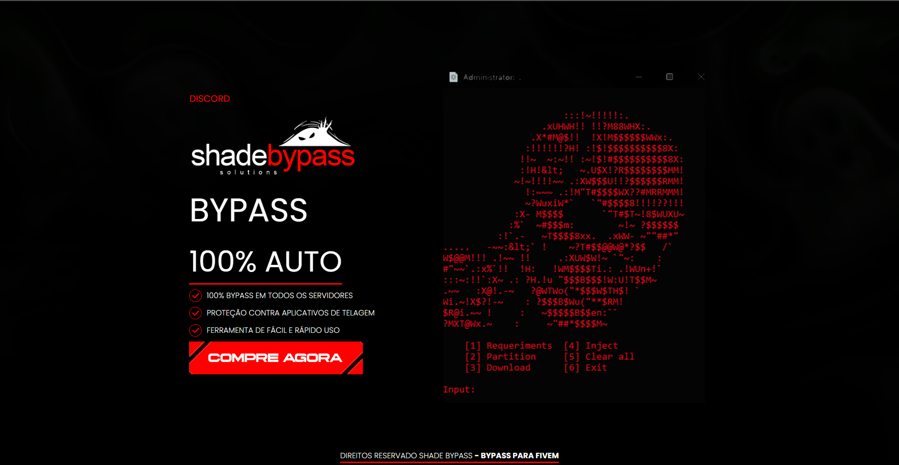

<h1 align="center">ShadeByPass</h1>

<!-- Getting Started -->
# Sobre o projeto
LP desenvolvida para uma loja do discord onde vende produtos para um jogo específico, a LP consiste em informações do produto e o link para a compra direto no discord.
<a href="https://shadebypass.xyz/" target="_blanck">Visitar o site</a>

### INICIANDO O PROJETO

Para instalar o projeto em sua maquina siga os passos abaixo.

### INSTALAÇÃO

1. Clone o repositório

   ```sh
   git clone https://github.com/NiloMarcos/shadebypass.git
   ```

2. Entre na pasta

   ```sh
   cd shadebypass
   ```

3. Abra o arquivo .html

   ```sh
   Assim a LP irá abrir em seu navegador.
   ```

### Apresentação da aplicação

<p align="center">

<div>
   
</div>